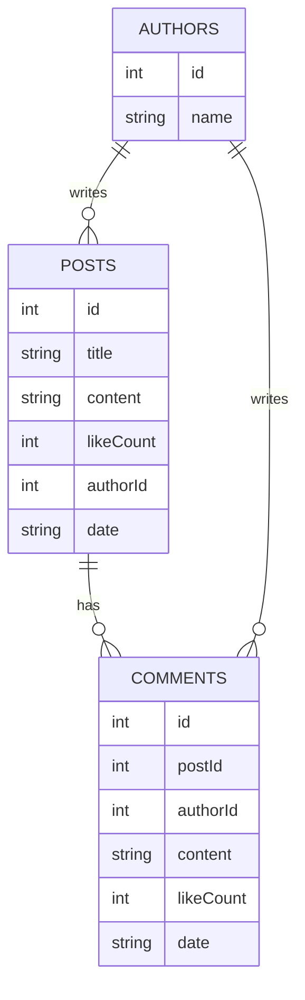

# Архитектура API

## Структура данных

## Эндпоинты API

### Посты

- GET /api/posts - Получить все посты
- GET /api/posts/{id} - Получить пост по ID
- POST /api/posts - Создать новый пост
- PUT /api/posts/{id} - Обновить пост по ID
- DELETE /api/posts/{id} - Удалить пост по ID

### Комментарии

- GET /api/comments - Получить все комментарии
- GET /api/comments/{id} - Получить комментарий по ID
- POST /api/comments - Создать новый комментарий
- PUT /api/comments/{id} - Обновить комментарий по ID
- DELETE /api/comments/{id} - Удалить комментарий по ID

### Авторы

- GET /api/authors - Получить всех авторов
- GET /api/authors/{id} - Получить автора по ID
- POST /api/authors - Создать нового автора
- PUT /api/authors/{id} - Обновить автора по ID
- DELETE /api/authors/{id} - Удалить автора по ID
